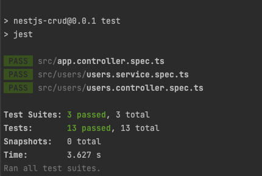
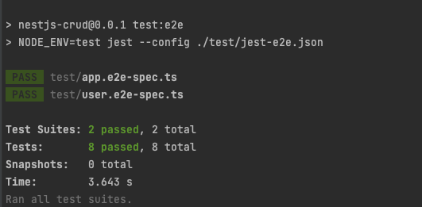
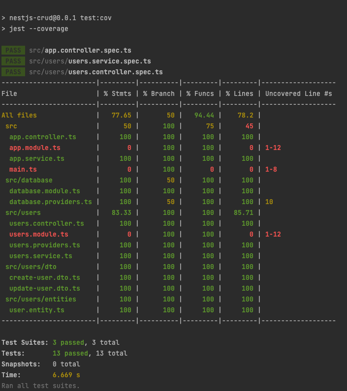

# NestJS CRUD, TypeORM with SQLite, and testing
- reference: [NestJS SQL (TypeORM)](https://docs.nestjs.com/recipes/sql-typeorm)
- reference: [TypeORM Connection Options](https://typeorm.io/#/connection-options)
- reference: [NestJS CRUD generator](https://docs.nestjs.com/recipes/crud-generator)
- reference: [NestJS Testing](https://docs.nestjs.com/fundamentals/testing)

## Test Environments
- Node.js v16.13.1
- MacOS v12.2.1

This example project is using [NestJS CRUD, TypeORM with SQLite](https://github.com/taptorestart/nodejs-examples/tree/main/nestjs/nestjs-crud-sqlite) example.

Please see the [NestJS CRUD, TypeORM with SQLite](https://github.com/taptorestart/nodejs-examples/tree/main/nestjs/nestjs-crud-sqlite) example

## Install
```ssh
$ npm install
```

## Test
```ssh
$ npm run test
```


## Test end to end
```ssh
$ npm run test:e2e
```


## Test coverage
```ssh
$ npm run test:cov
```
