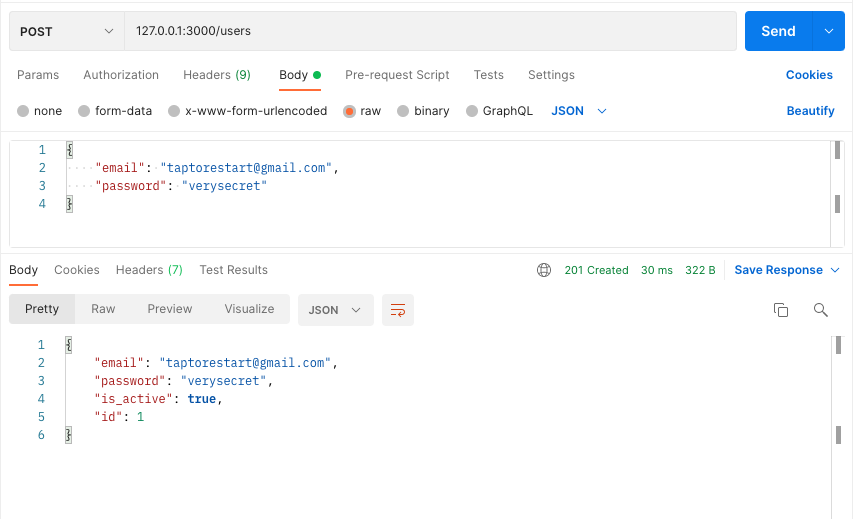
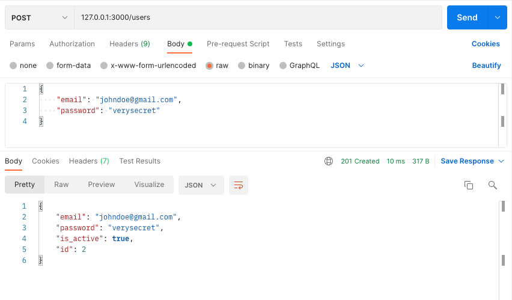
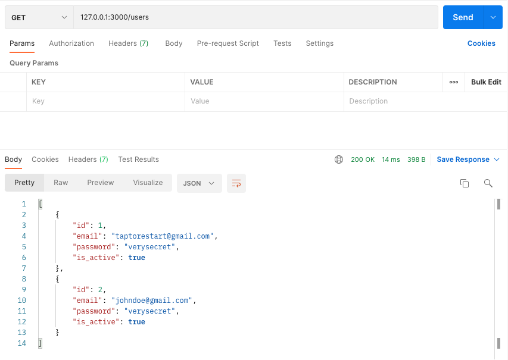
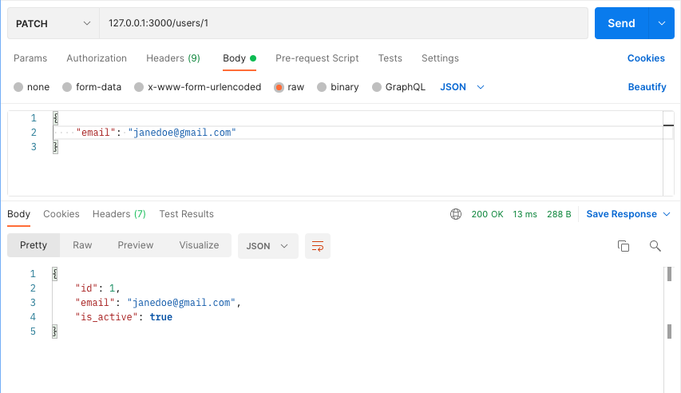
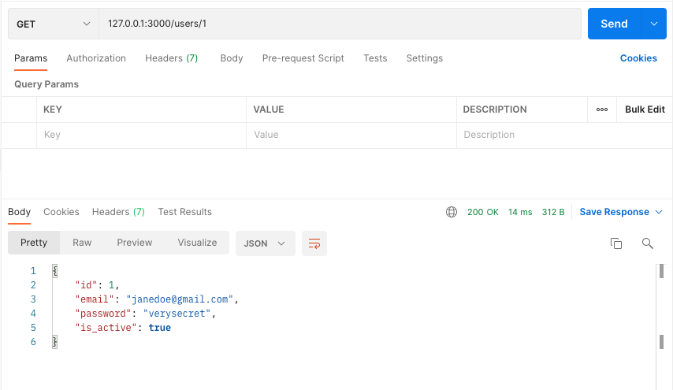
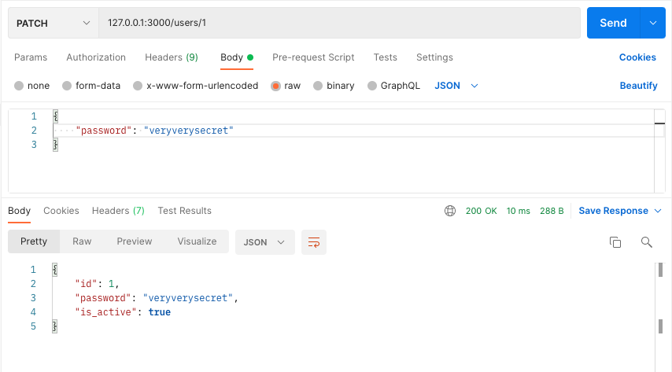
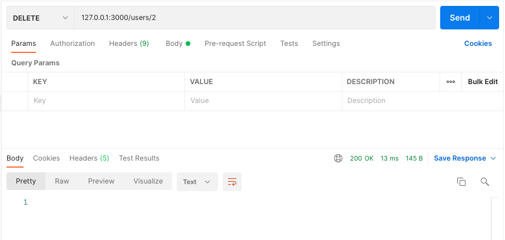
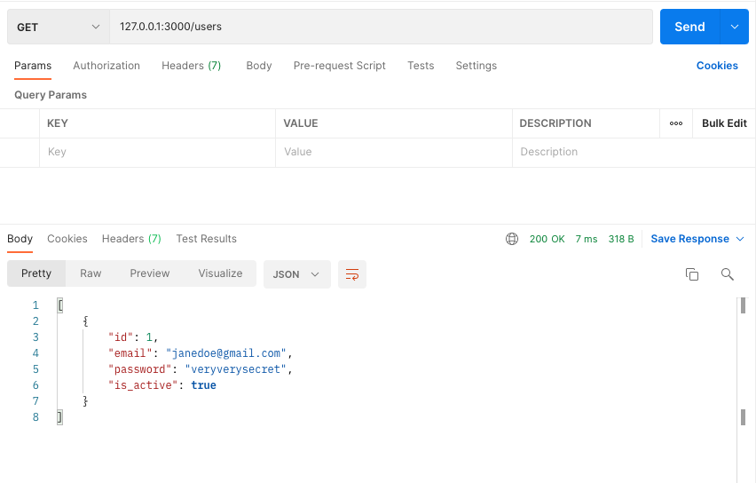

# NestJS CRUD, TypeORM with SQLite
- reference: [NestJS SQL (TypeORM)](https://docs.nestjs.com/recipes/sql-typeorm)
- reference: [TypeORM Connection Options](https://typeorm.io/#/connection-options)
- reference: [NestJS CRUD generator](https://docs.nestjs.com/recipes/crud-generator)

## Test Environments
- Node.js v16.13.1
- MacOS v12.2.1

## Install
```ssh
$ npm install typeorm --save
$ npm install @nestjs/typeorm --save 
$ npm install better-sqlite3 --save
$ nest g resource users
```

or

```ssh
$ npm install 
```

## Run
```ssh
$ npm run start:dev
```

## Screenshots

Create first user



Create second user



Read users



Update first user's email



Read first user



Update first user's password



Read first user


Delete second user



Read users


