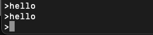
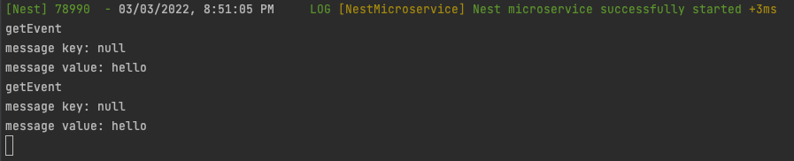

# NestJS Kafka Consumer
reference: [NestJS Microservices Kafka](https://docs.nestjs.com/microservices/kafka#message-pattern)

## Test Environments
- Node.js v16.13.1
- MacOS v12.2.1

## Install Kafka
source: [Kafka Quick Start](https://kafka.apache.org/quickstart)

```shell
# STEP 1: GET KAFKA
$ tar -xzf kafka_2.13-3.1.0.tgz
$ cd kafka_2.13-3.1.0

# STEP 2: START THE KAFKA ENVIRONMENT
# Start the ZooKeeper service
$ bin/zookeeper-server-start.sh config/zookeeper.properties

# Start the Kafka broker service
$ bin/kafka-server-start.sh config/server.properties

# STEP 3: CREATE A TOPIC TO STORE YOUR EVENTS
$ bin/kafka-topics.sh --create --topic quickstart-events --bootstrap-server localhost:9092

# STEP 4: WRITE SOME EVENTS INTO THE TOPIC
$ bin/kafka-console-producer.sh --topic quickstart-events --bootstrap-server localhost:9092
This is my first event
```

## Install Packages
For this example
```shell
$ npm i --save kafkajs
$ npm i --save @nestjs/microservices
```

```shell
$ npm install
```

## Screenshots





