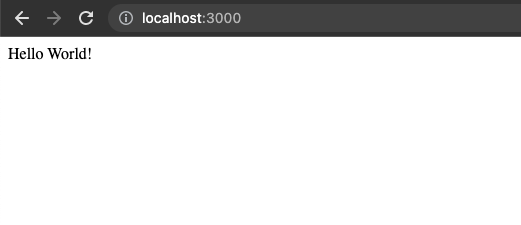
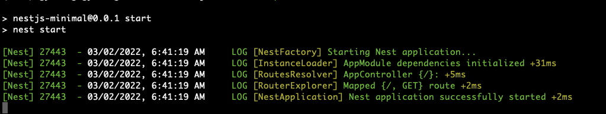

# NestJS Minimal project
Source: [NestJS OVERVIEW First steps](https://docs.nestjs.com/first-steps)

## Test Environments
- Node.js v16.13.1
- MacOS v12.2.1

## Install
```ssh
$ npm i -g @nestjs/cli
$ nest new nestjs-minimal

? Which package manager would you ❤️  to use? npm

$ cd nestjs-minimal
```

## Run
```ssh
$ npm run start
```

Open your browser at http://127.0.0.1:3000 or http://localhost:3000

## Screenshots



