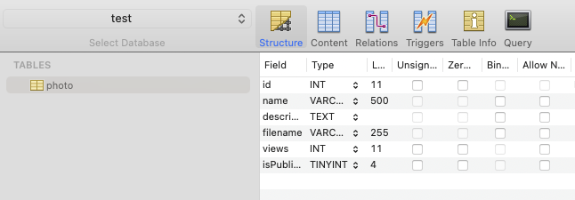

# NestJS TypeORM with MySQL
- source: [NestJS SQL (TypeORM)](https://docs.nestjs.com/recipes/sql-typeorm)
- source: [NestJS Configuration](https://docs.nestjs.com/techniques/configuration)

## Test Environments
- Node.js v16.13.1
- MacOS v12.2.1

## Install
```ssh
$ npm install --save typeorm mysql2
$ npm i --save @nestjs/config
```
or
```ssh
$ npm install 
```

## Environment variables
Please create .env file and set variables for connection database.
```
HOST=localhost
USERNAME=admin
PASSWORD=verysecret
DATABASE=test
```

## Run
```ssh
$ npm run start:dev
```

## Screenshots

