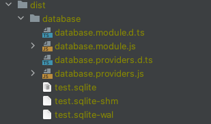
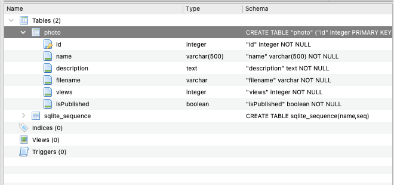

# NestJS TypeORM with SQLite
- reference: [NestJS SQL (TypeORM)](https://docs.nestjs.com/recipes/sql-typeorm)
- reference: [TypeORM Connection Options](https://typeorm.io/#/connection-options)

## Test Environments
- Node.js v16.13.1
- MacOS v12.2.1

## Install
```ssh
$ npm install typeorm --save
$ npm install better-sqlite3 --save
```

or 

```ssh
$ npm install 
```

## Run
```ssh
$ npm run start:dev
```

## Screenshots
You can find sqlite file on dist/database directory.


Table Photo
