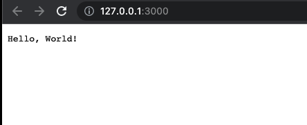
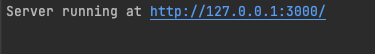

# Node.js Minimal project
source: https://nodejs.org/dist/latest-v16.x/docs/api/synopsis.html

## Test Environments
- Node.js v16.13.1
- MacOS v12.2.1

## Run
```ssh
$ node app.js
```

Open your browser at http://127.0.0.1:3000 or http://localhost:3000

## Screenshots



