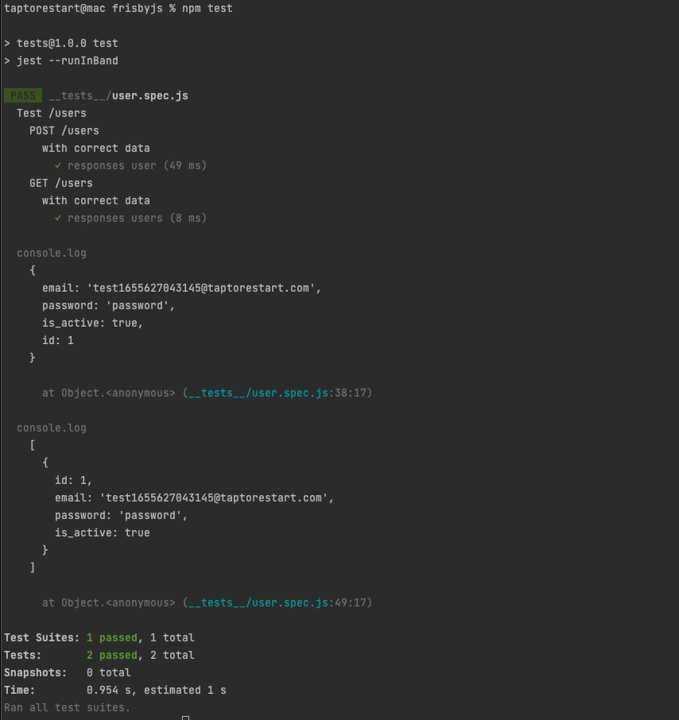
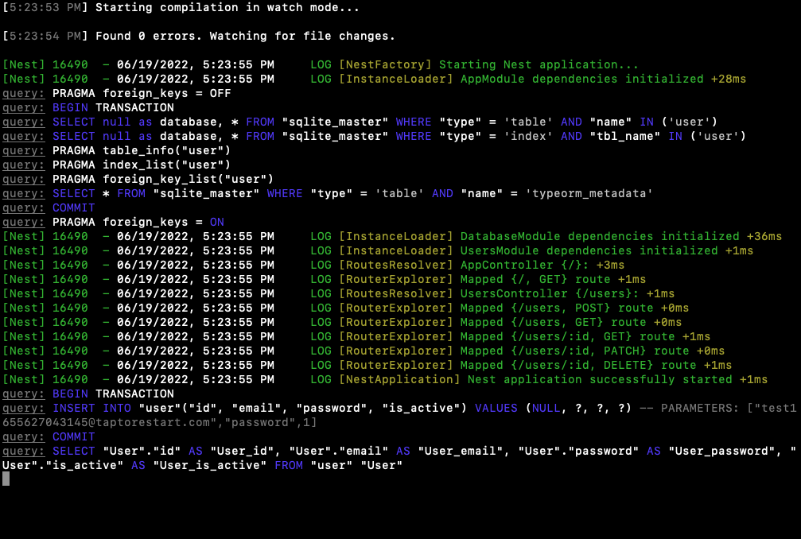

# REST API Test by frisby.js
"Frisby makes REST API testing easy, fast, and fun." - [frisby.js documentation](https://docs.frisbyjs.com/)

## Install
```ssh
$ npm install
```

## Run
```ssh
$ npm test
```

## Screenshots
This example is testing [NestJS - CRUD, TypeORM with SQLite](https://github.com/taptorestart/nodejs-examples/tree/main/nestjs/nestjs-crud-sqlite) example project.

Please run NestJS example at first. Then run frisby.js example.

Test Result Example




